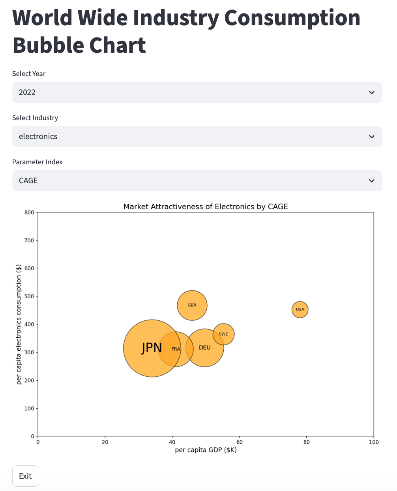

# CAGE_Calculation

- 본 프로젝트는 학회 활동 중 교수님의 특강을 통해 배운 Pankaj Ghemawat의 “Distance Still Matters" 논문에 등장한 CAGE 프레임워크를 기반으로 국가별 산업 데이터를 종합적으로 분석하여 시장 매력도를 정량적으로 평가하고 이를 시각화하여 사용자의 직관적 의사결정에 도움이 되고자 하는 목적을 가지고 있습니다.
- Streamlit 기반의 그래프 출력 인터페이스는 사용자가 연도, 산업, 평가지표를 선택할 수 있는 환경을 통해 동적인 상호작용이 가능하도록 구현되었습니다.

---

## 프로젝트의 목적

- 본 프로젝트는 국내 기업의 해외진출 전략 수립 중, 시장 선정 단계에서 겪는 객관적 판단의 어려움을 해소하고자 시작되었습니다.
- CAGE 프레임워크란 Cultural, Administrative, Geographic, Economic 각각의 Distance를 종합 측정하여 고전적 시장 평가 방식을 보완하도록 설계된 평가 도구이며 본 프로젝트에서는 기존 정량 지표의 무역영향도에 대한 계수 변경 대신 산업의 시장 수익성에 대한 평가 지표를 추가하여 기존의 부족했던 산업별 차별성을 보완했습니다.
- 사용자는 분석 도구를 사용하여 기존의 객관적 기준과 정량적 신뢰성이 결여된 주관적 평가 방식의 약점을 극복하고 산업 진입전략 또는 글로벌 마케팅 전략 수립의 효율화를 달성할 수 있을 것으로 기대합니다.

---

## 프로젝트 구조

```
CAGE_calculation/
├── data/
│   ├── 2022/
│   │   ├── general.csv
│   │   ├── apparel.csv
│   └── General_info.csv
├── src/
│   ├── main.py             
│   └── modules/
│       ├── __init__.py
│       ├── bubble_node.py
│       ├── calculator.py
│       └── visualizer.py
├── requirements.txt
├── README.md
└── screenshots/
    └── example_chart.png
```

---

## 실행 방법
**본 프로젝트는 Mac 환경을 기반으로 작성되었습니다.

```bash
# 1. 프로젝트 폴더 진입
cd CAGE_Calculation

# 2. 가상환경 생성
python -m venv venv
source venv/bin/activate 

# 3. 라이브러리 설치
pip install -r requirements.txt

# 4. Streamlit 실행
streamlit run src/main.py
```

- 웹브라우저가 자동 실행되며, UI에서 연도/산업/지표 선택 가능

---

## 결과 예시

<p align="center">
  
</p>

---

## 추가 디테일
```
데이터출처: 
databank.worldbank.org    (인구수, 총생산)
sea-distances.org         (지리적 거리 측정)
thetruesize.com           (지리적 규모 측정)
stan database for structural analysis, 2025 edition (산업 총생산, 부가가치)
statista-market-insights  (국가별 산업규모)
```
- 본 프로젝트는 CAGE 프레임워크를 구현하는 인터페이스를 구성해보고자 진행한 단기 개발 프로젝트로서 확장 가능한 구조를 구축하였습니다.
- 현재는 학회 세션에서 활용한 의류 시장과 자동차, 가전 산업에 대한 데이터가 저장되어 활용될 수 있습니다.
- 데이터베이스 시스템을 활용하는 대신 간단한 구조를 위해 .csv 파일에 데이터가 저장된 파일시스템을 채택하여 기초적인 수준의 코드 내 입출력을 구현하였습니다.
- 버블차트는 국가별로 노드를 생성하여 저장된 계산값을 활용해 matplotlib 라이브러리로 출력하는 방식을 활용하였으며 각 버블노드는 linked list 구조로 저장되었습니다.
- 본 프로젝트는 LLM을 활용하여 개발되었습니다.

---

## 개선 가능성

- 데이터베이스 활용으로 데이터규모 및 접근 편리성 증진
- 추가 산업군에 대한 데이터 및 시계열 정보 확장
- 산업군 별 회귀분석 혹은 기계학습으로 CAGE 계수 정밀화
